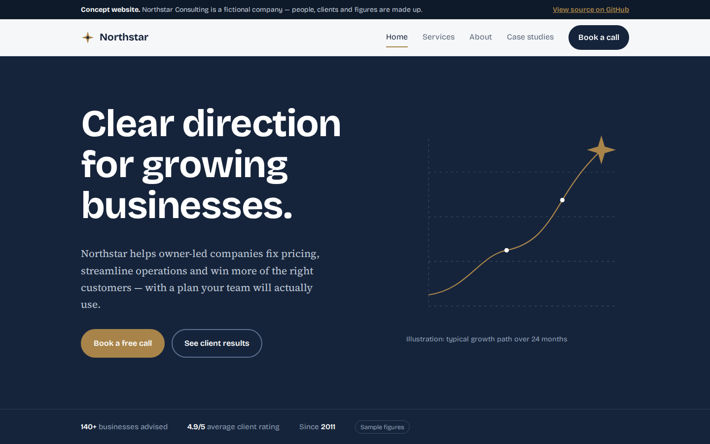
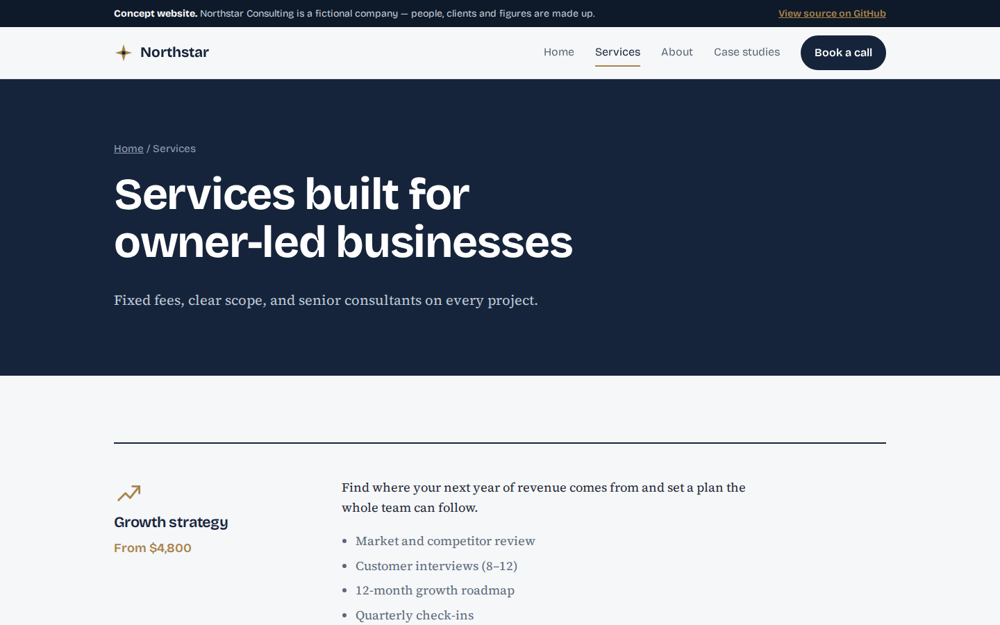
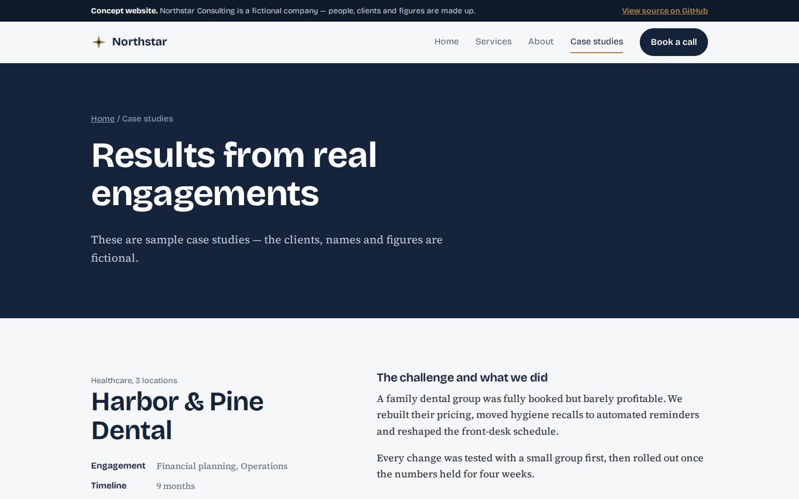
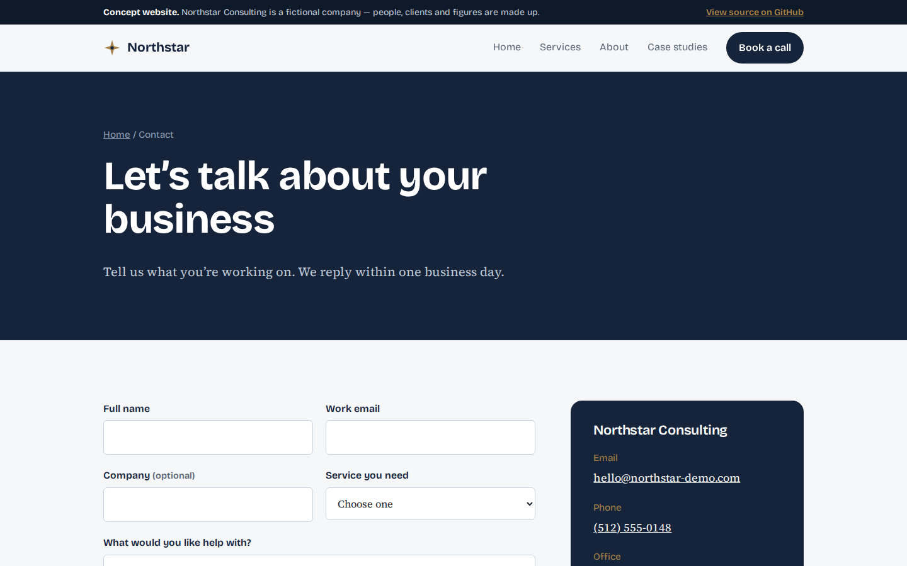
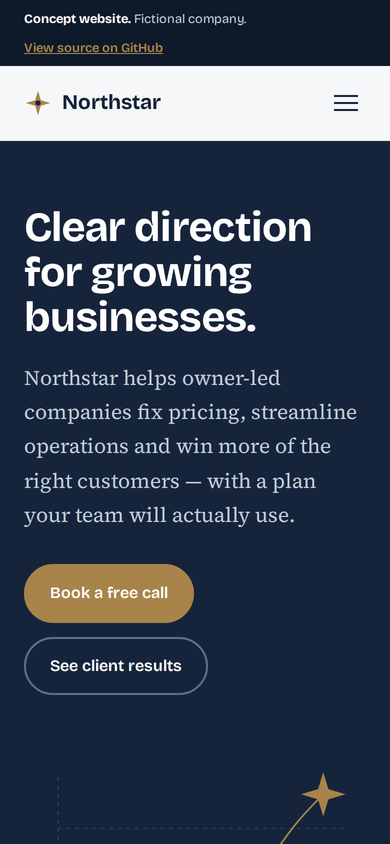
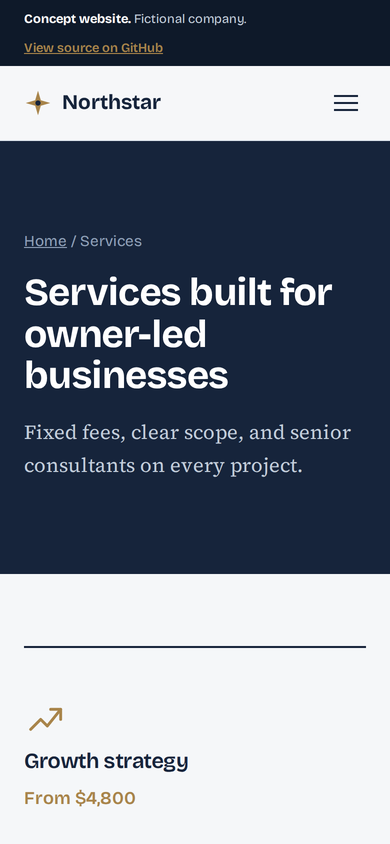

# Northstar Consulting — Professional business website

> **Concept project.** Northstar Consulting is a fictional business created for a web design portfolio. All names, people, reviews, figures and prices are samples. No real orders, payments or messages are processed.

**[View the live demo →](https://gmoo7.github.io/northstar-consulting/)**

A multi-page website for a fictional consulting firm. The structure works for almost any service business: consultancies, agencies, law and accounting firms, clinics, IT companies.

## Features

- **Home**: value proposition, services, about, case studies, testimonials, FAQ and calls to action
- **Services**: six services with scope and starting prices, plus a four-step engagement process
- **About**: company story, team and working principles
- **Case studies**: three client projects with measured results
- **Contact**: enquiry form with inline validation, email, phone, location and hours
- Responsive layout with a mobile menu, visible keyboard focus, skip link and reduced-motion support
- SEO basics: unique titles and descriptions, Open Graph previews, canonical URLs, structured data, `sitemap.xml`, `robots.txt`

## Screenshots

|  |  |
|:--:|:--:|
| Home | Services |
|  |  |
| Case studies | Contact |

### Mobile

 &nbsp; 

## Built with

Plain HTML, CSS and JavaScript. No framework and no build step. Fonts are self-hosted, so the site makes no third-party requests.

## Run it locally

Open `index.html` in a browser, or serve the folder with any static host.

## Quality checks

Tested in Chromium at 360px, 390px and 1440px widths: no horizontal scrolling, no broken links, no JavaScript errors, and every button and form tested end to end.

---

Designed and built by [Hashir](https://github.com/GMoo7). Available for website projects for small and growing businesses.
